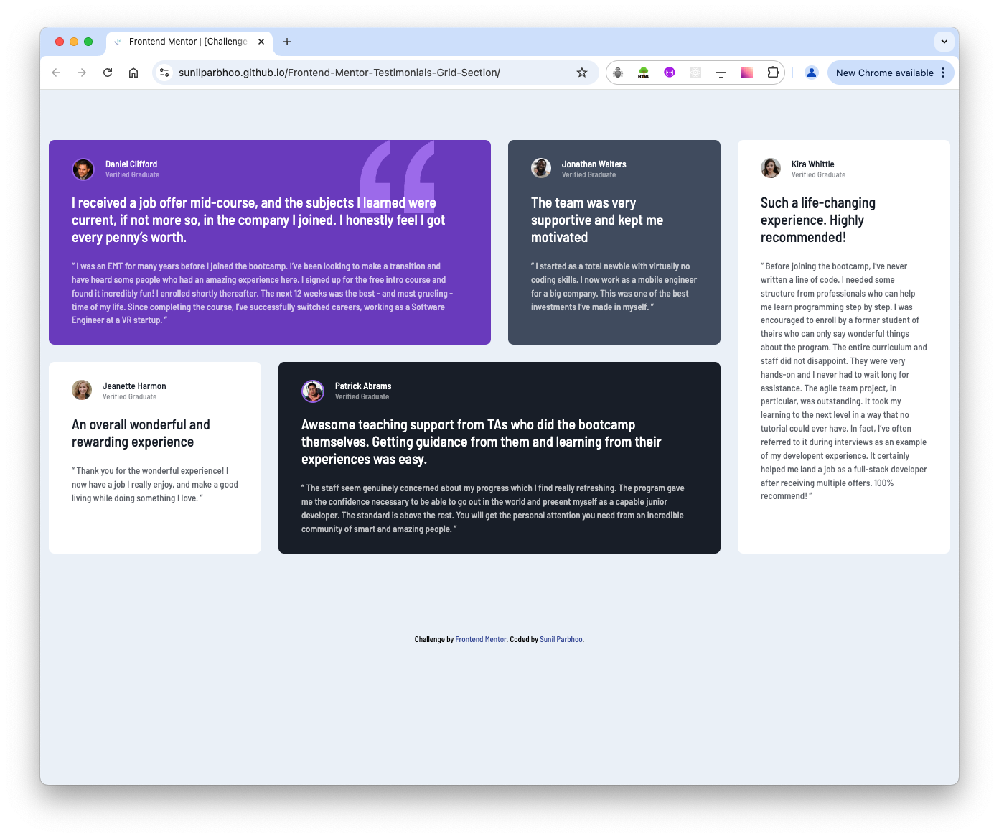

# Frontend Mentor - Testimonials grid section solution

This is a solution to the [Testimonials grid section challenge on Frontend Mentor](https://www.frontendmentor.io/challenges/testimonials-grid-section-Nnw6J7Un7). Frontend Mentor challenges help you improve your coding skills by building realistic projects.

## Table of contents

- [Frontend Mentor - Testimonials grid section solution](#frontend-mentor---testimonials-grid-section-solution)
  - [Table of contents](#table-of-contents)
  - [Overview](#overview)
    - [The challenge](#the-challenge)
    - [Screenshot](#screenshot)
    - [Links](#links)
  - [My process](#my-process)
    - [Built with](#built-with)
    - [What I learned](#what-i-learned)
  - [Author](#author)

## Overview

### The challenge

Users should be able to:

- View the optimal layout for the site depending on their device's screen size

### Screenshot

### Links

- Solution URL: [Frontend Mentor Testimonials Grid Section](https://www.frontendmentor.io/solutions/responsive-testimonials-grid-section--iwU9b82Fk)
- Live Site URL: [Testimonials Grid Section](https://sunilparbhoo.github.io/Frontend-Mentor-Testimonials-Grid-Section/)

## My process

I examined both the mobile and desktop design images, identifying similarities in the card markup, then utilizing mobile first approach, I created the html markup and the css styles. I utilized css grid and flexbox to achieve the differing mobile/tablet/desktop layouts.

### Built with

- Semantic HTML5 markup
- CSS custom properties
- Flexbox
- CSS Grid
- Mobile-first workflow

### What I learned

As with prior Frontend Mentor challenges, I practiced reviewing design specifications, designing the appropriate markup for a responsive page, and I practiced utilizing flexbox and CSS Grid. Specifically with grid, I practiced working with grid-template-areas / grid-area, and the CSS repeat() function in order to encorporate more modern CSS and make the layout easier to develop compared to classic CSS.

## Author

- GitHub - [Sunil Parbhoo](https://github.com/SunilParbhoo)
- Frontend Mentor - [@sunilparbhoo](https://www.frontendmentor.io/profile/sunilparbhoo)
